<div align="center">



</div>

<div align="center">

[](https://git.io/typing-svg)

</div>

<br/>

<div align="center">

[](https://disasgamage.vercel.app)
&nbsp;
[](https://www.linkedin.com/in/disas-gamage-7748a22b4)
&nbsp;
[](https://www.instagram.com/disas_10.20/)
&nbsp;
[](https://www.facebook.com/profile.php?id=61550039511639)
&nbsp;
[](https://github.com/d3mio)

</div>

<br/>

---

##  &nbsp;`$ whoami`


```yaml
╔══════════════════════════════════════════╗
║           ENGINEER PROFILE               ║
╠══════════════════════════════════════════╣
║  Name    : Disas Gamage                  ║
║  Alias   : d3mio                         ║
║  Role    : Software Engineer             ║
║            Creative Technologist         ║
║  Domains : Full-Stack · IoT · ML         ║
║  Design  : UI/UX · Graphic · Visual      ║
║  Status  : [ BUILDING ] ████████░░ 80%   ║
║  Location: 🌏 Remote · Global            ║
║  Site    : disasgamage.vercel.app        ║
╚══════════════════════════════════════════╝
```

I design and build **end-to-end digital systems** — from pixel-perfect interfaces to embedded hardware integrations. My engineering philosophy sits at the convergence of **performance**, **scalability**, and **design intelligence**.

- 🌱 &nbsp; Architecting **React Native** mobile systems and **Node.js** backends built to scale
- ⚙️ &nbsp; Bridging physical & digital worlds through **IoT** with ESP32, Arduino & ADS1115
- 📊 &nbsp; Applying **Machine Learning** to real-world classification and prediction tasks
- 🤝 &nbsp; Open to **high-impact collaborations** — open source, startups, and research
- 💡 &nbsp; Core belief: *great software is empathetic, measurable, and maintainable*
- 🌐 &nbsp; See the full picture → **[disasgamage.vercel.app](https://disasgamage.vercel.app)**

<br clear="right"/>

---

## 🏛️ Engineering Domains

<table>
<tr>
<td width="50%" valign="top">

### 🖥️ &nbsp;Full-Stack Web
Designing scalable web applications with clean architecture. From RESTful APIs and server-side logic to reactive UIs and responsive layouts — built for production, not just prototypes.

</td>
<td width="50%" valign="top">

### 📱 &nbsp;Mobile Engineering
Building cross-platform mobile applications using **React Native** with a focus on performance, offline capability, and native UX fidelity across iOS and Android.

</td>
</tr>
<tr>
<td width="50%" valign="top">

### ⚙️ &nbsp;IoT & Embedded Systems
Connecting the digital to the physical. Working with **ESP32**, **Arduino**, and **ADS1115** ADC modules to design sensor-driven systems, real-time data pipelines, and hardware-software interfaces.

</td>
<td width="50%" valign="top">

### 🤖 &nbsp;Machine Learning
Applying supervised learning techniques to real-world datasets — feature engineering, model evaluation, and classification pipelines — using Python's ML ecosystem.

</td>
</tr>
<tr>
<td width="50%" valign="top">

### 🎨 &nbsp;UI/UX & Design Systems
Crafting design systems in **Figma** from wireframe to high-fidelity prototype. Applying UX research principles, typography, and visual hierarchy to create interfaces users love.

</td>
<td width="50%" valign="top">

### 📐 &nbsp;Graphic & Visual Design
End-to-end visual production across **Adobe Illustrator**, **Photoshop**, **Lightroom**, and **Canva** — brand identity, digital content, and visual storytelling.

</td>
</tr>
</table>

---

## 🧰 Technology Arsenal

<div align="center">

### ◈ Languages


### ◈ Frameworks & Runtimes


### ◈ Machine Learning & Data Science


### ◈ IoT & Embedded Systems


### ◈ Databases & Cloud


### ◈ Design & Creative Suite


### ◈ DevOps & Tooling


</div>

---

## 🔭 Current Focus

<table>
<tr>
<td width="5%" align="center">🌱</td>
<td>

**Scaling Mobile Architectures with React Native & Node.js**
Deepening expertise in React Native for high-performance, cross-platform mobile applications. Architecting robust Node.js backends with REST APIs, middleware pipelines, and scalable data layers to support production-grade mobile systems.

</td>
</tr>
<tr><td colspan="2"><hr/></td></tr>
<tr>
<td align="center">⚙️</td>
<td>

**IoT Development — Bridging Software & Hardware**
Designing embedded systems and sensor interfaces using **ESP32**, **Arduino**, and **ADS1115** analog-to-digital converters. Building real-time telemetry pipelines, wireless communication protocols (Wi-Fi · BLE · MQTT), and hardware-software integration layers.

</td>
</tr>
<tr><td colspan="2"><hr/></td></tr>
<tr>
<td align="center">📊</td>
<td>

**Applied Machine Learning on Real-World Datasets**
Implementing supervised learning workflows end-to-end — from data preprocessing and feature engineering to model training, evaluation, and classification pipelines — using Python's ML ecosystem on practical, domain-specific datasets.

</td>
</tr>
<tr><td colspan="2"><hr/></td></tr>
<tr>
<td align="center">☁️</td>
<td>

**Cloud Infrastructure & CI/CD Pipelines**
Exploring cloud-native deployment strategies, containerization, and automated pipelines to ship faster and operate with confidence at scale.

</td>
</tr>
<tr><td colspan="2"><hr/></td></tr>
<tr>
<td align="center">🤝</td>
<td>

**Open Source Contribution**
Actively contributing to meaningful open-source repositories — reviewing PRs, filing issues, and shipping features that solve real problems for real developers.

</td>
</tr>
</table>

---

## 📊 GitHub Intelligence

<div align="center">


&nbsp;


</div>

<div align="center">


</div>

---

## 🧊 3D Contribution Graph

<div align="center">

[](https://github.com/d3mio)

</div>

---

## 🏆 GitHub Achievements

<div align="center">


</div>

---

## 🌐 Portfolio

<div align="center">

```
╔══════════════════════════════════════════════════════════════╗
║                                                              ║
║    🔗  disasgamage.vercel.app                                ║
║                                                              ║
║    Projects · IoT Builds · ML Experiments · Design Work      ║
║                                                              ║
╚══════════════════════════════════════════════════════════════╝
```

**[→ View Portfolio](https://disasgamage.vercel.app)**

</div>

---

## 💬 Engineering Philosophy

<div align="center">

> *"The function of good software is to make the complex appear simple."*
> &nbsp;&nbsp;— Grady Booch

<br/>

> *"Any fool can write code that a computer can understand. Good programmers write code that humans can understand."*
> &nbsp;&nbsp;— Martin Fowler

</div>

---

<div align="center">


*Crafted with precision &nbsp;·&nbsp; Powered by curiosity &nbsp;·&nbsp; Built to last*

</div>
